# DriverApp

[🇷🇺 Read in Russian](README_RU.md)

An application for a transportation company’s drivers.  

## Tech Stack
- Kotlin  
- Coroutines  
- Flow  
- Hilt  
- MVVM  
- Room  
- Retrofit  
- Yandex Maps API (mapkit)  

## Additional Information
The application is under development.  
Repository contains code samples for portfolio purposes. Some implementation details and API credentials have been removed/replaced. 

## Application

### Navigation Menu
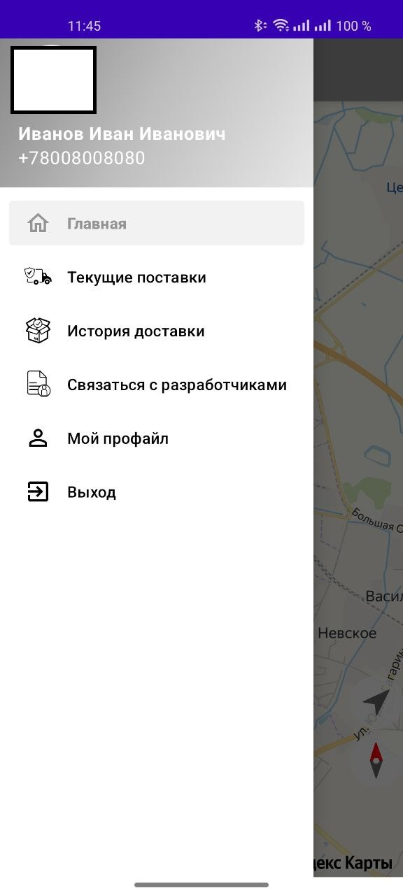

### Main Page
Main fragment with a map.  
Objects on the map, orientation, and zoom depend on the status of the active order.  
If there is no active order → the current location is displayed.  
Available buttons:
- center the map on the current location  
- orient the map to the north  

If there is an active order, brief information for the current status and a button to navigate to the **Order Status** fragment are displayed.  
An "info" button is available in the top right menu, visible only if there is an active order.  
When pressed, it opens a card with general order details.  

  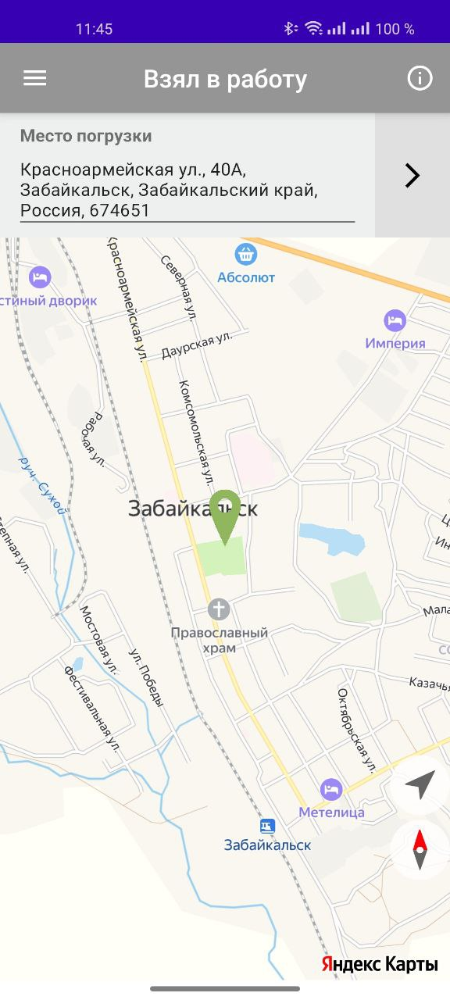
  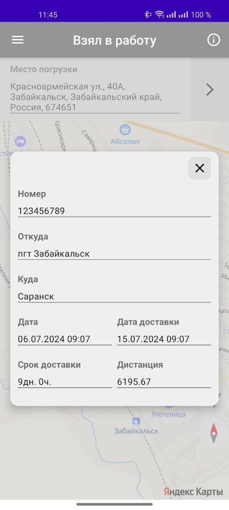

### Current Deliveries
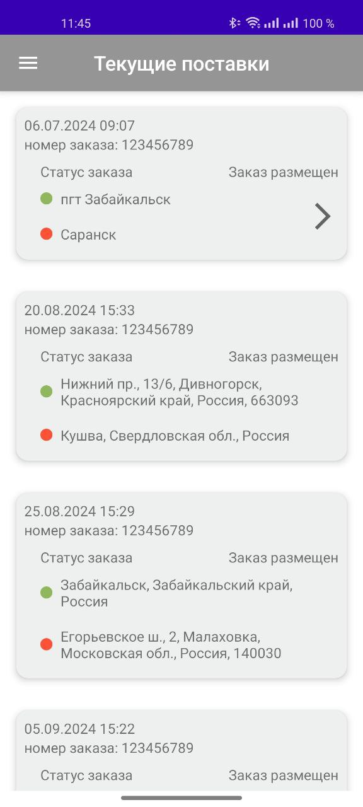

### Current Order
If the order is not yet active (status: "order placed"), it can be accepted.  
If the order is active, the button changes between "**take in progress**" and "**status**".  
When:  
- "**take in progress**" → the order status changes  
- "**status**" → navigates to the "Order Status" fragment  

The delivery time is calculated as the date difference (with mathematical rounding of hours).  

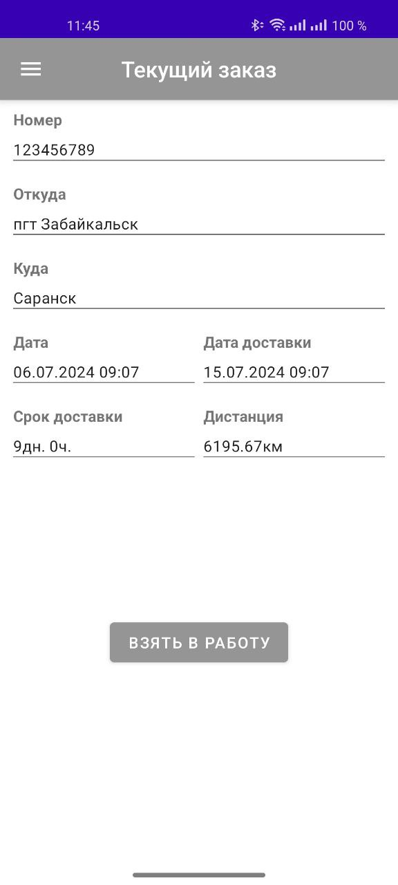

### Order Status
The button at the bottom of the page changes the order status to the next one.  
Different information is displayed depending on the status.  
The map is static and all interaction is disabled (except clicking).  
Clicking on the map navigates to the main fragment.  

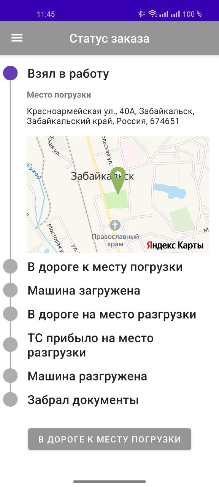

#### Order Status: Vehicle Loaded
After loading, the route from the loading point to the unloading point is displayed.  

 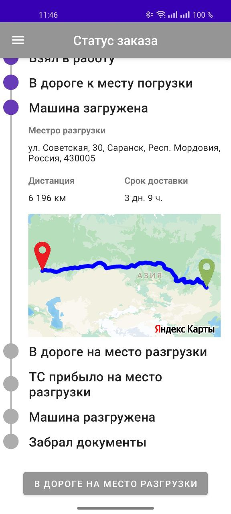
 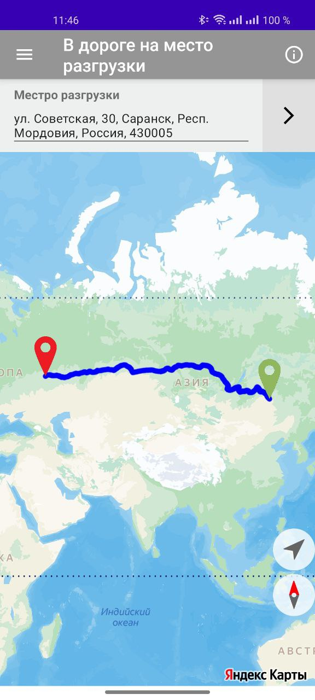
  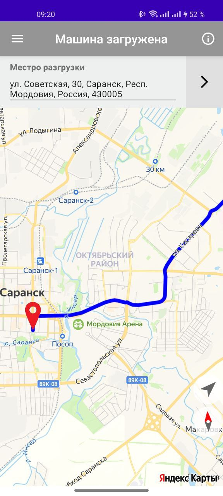

#### Order Status: On the Way
An "**on a stop**" button is available, which:  
- changes the order status  
- adds a marker on the map at the current location  
- hides the button to switch to the "**vehicle arrived at unloading point**" status  
- changes its text back to "**on the way**" for returning to that status  

If there are multiple stops along the route, all of them will be shown on the map and main fragment.  

  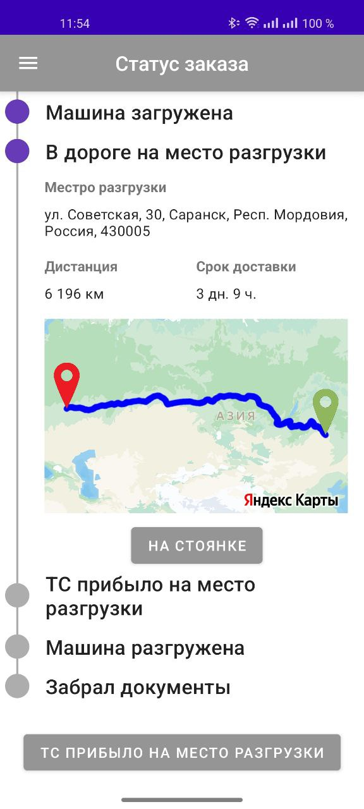
  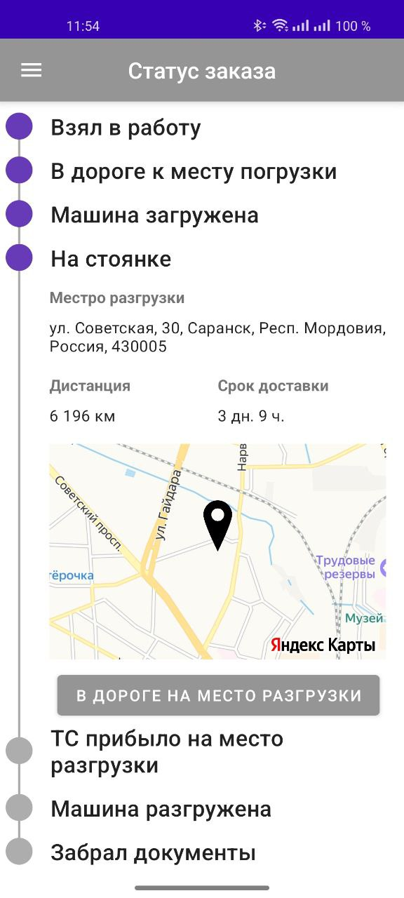

#### Order Status: Upload Documents
The button allows uploading a photo from files or taking a photo with the camera.  
Uploaded documents can be previewed before sending.  

  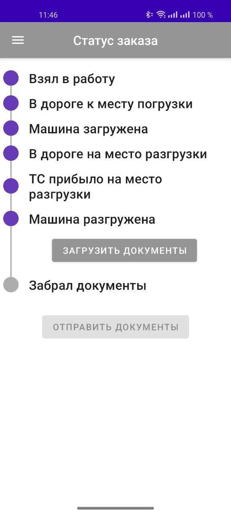
  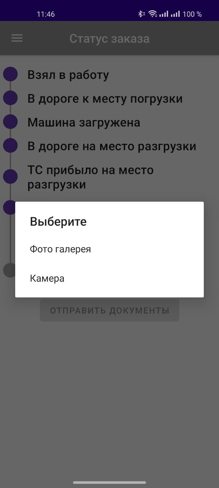
  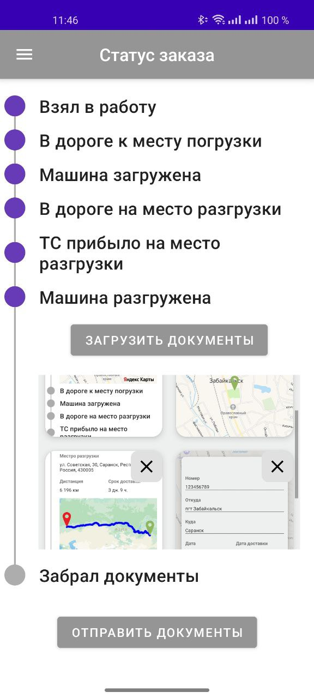

### Dark Theme Support

  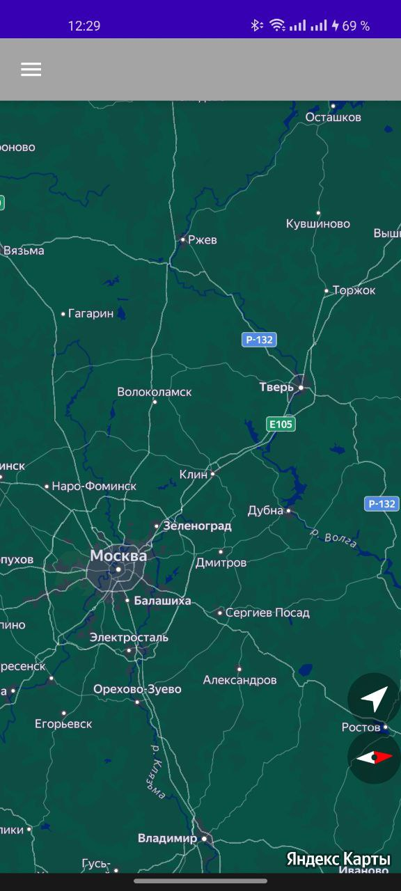
  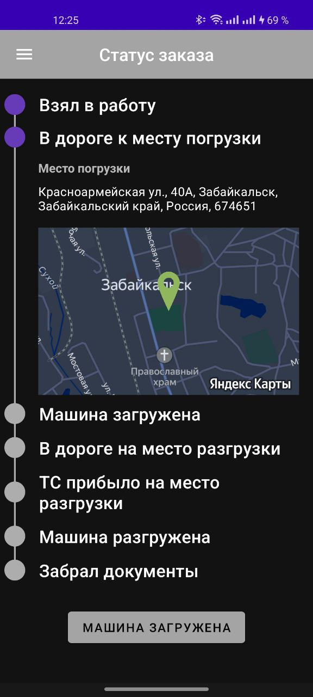
  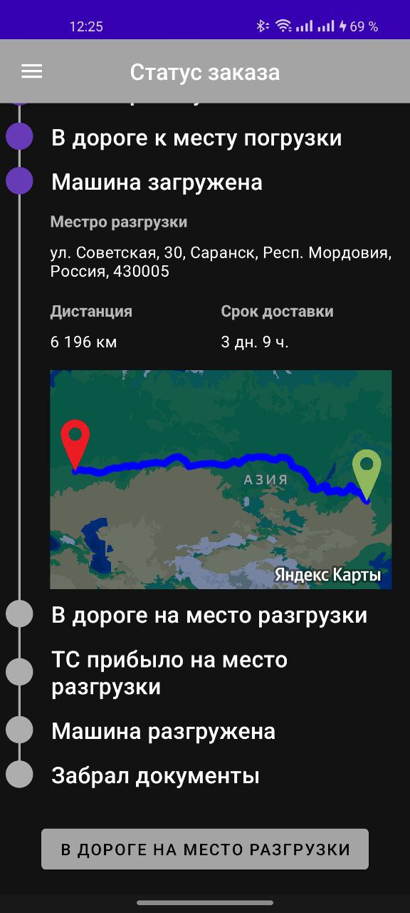

### Order History (sorted by date in descending order)
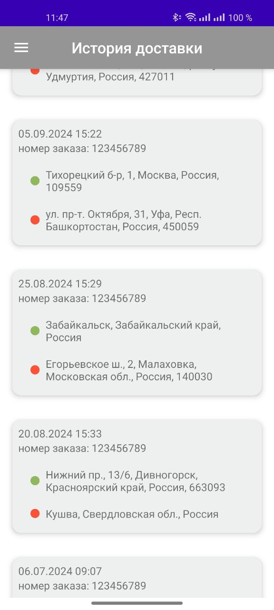

### Contact Developer
**Telegram** and **WhatsApp** → open messengers with a chat window.  
Pressing "**call**" starts a phone call.  

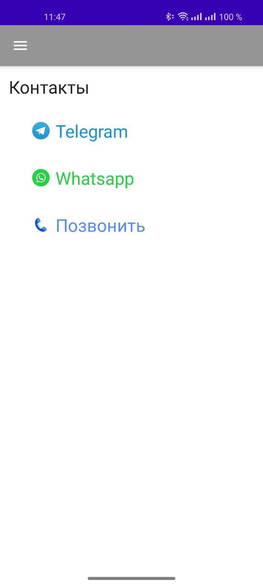

### My Profile and Change Password

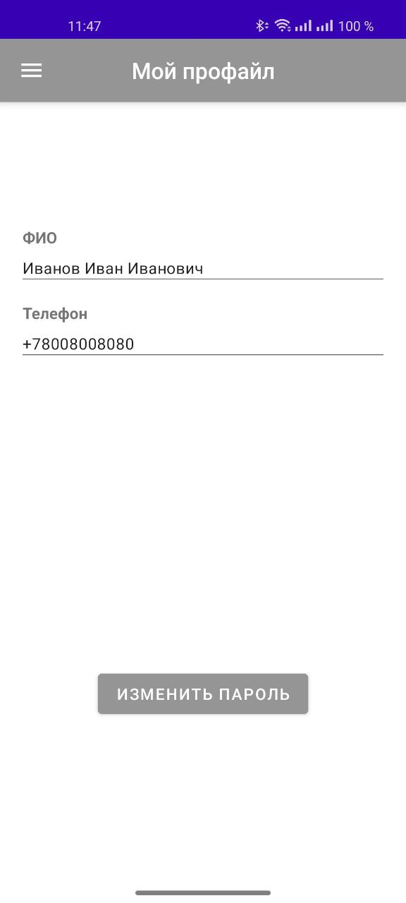
  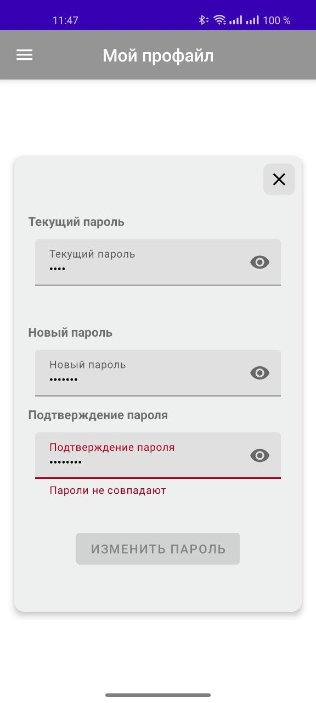
  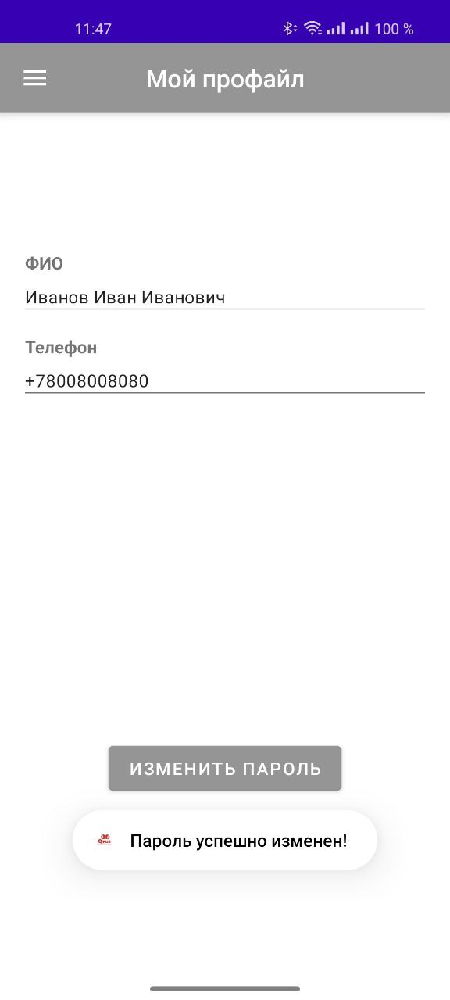

