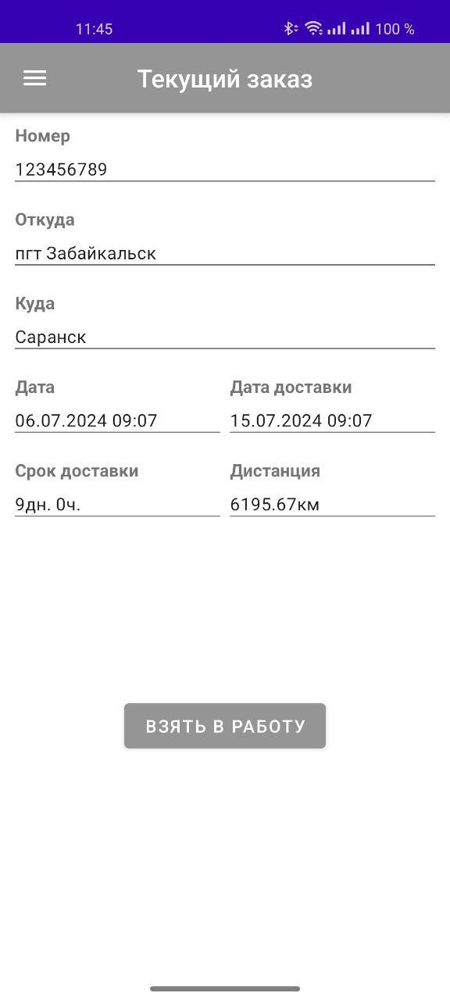
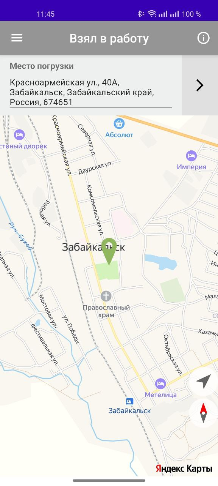
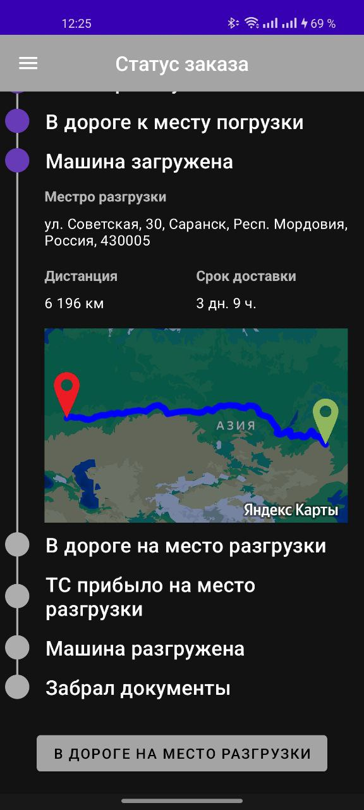

# DriverApp

## Навигационное меню

## Текущие поставки

## Текущий заказ
Если заказ еще не активен (статус "заказ размещен"), его можно принять.  
Если заказ активен, кнопка меняет значения с "**взять в работу**" на "**стаутс**".  
При значении
* "**взять в работу**" -> меняется статус заказа
* "**стаутс**" -> переход на фрагмент "Статус заказа"

Срок доставки расчитывается как разница дат (с математическим округлением часов)

## Статус заказа
Кнопка внизу страницы меняет статус заказа на следующий.  
При разном статусе показывается различная информация.  
Карта неподвижна и любое взаимодейсвтие с ней заблокировано (кроме клика).  
По клику по карте происходит переход на главный фрагмент.

## Главная страница
Главный фрагмент с картой.  
Объекты на карте, ориентирование и масштаб карты зависят от статуса активного заказа.  
Если активного заказа нет -> показывается текущее местоположение.  
Доступны кнопки
* центрирования карты на текущем положении
* ориентирования карты по северу

Если есть активный заказ, показывается краткая информация для текущего статуса и кнопка перехода на фрагмент **Статус заказа**.  
Доступна кнопка "info" в верхнем меню справа, которая видна только при наличии активного заказа.  
При нажатии открывается карточка с общей информацией по заказу.

  
  

## Статус заказа: машина загружена
После загрузки машины виден маршрут от пункта загрузки до пункта разгрузки

 
 
  

## Статус заказа: в дороге
доступна кнопка "**на стоянке**", которая:
* изменяет статус заказа
* добавляет метку на карте текущего местоположения
* скрывает кнопку перехода на статус "**ТС прибыло на место разрузки**"
* меняет текст кнопки на "**в дороге**", для возвращения к данному статусу

При нескольких стоянок на маршруте на карте и на главном фрагменте будут показаны все стоянки.

  
  

## Поддержка темной темы

  
  
  

## Статус заказа: загрузить документы
По кнопке доступна загрузка фото из файлов или можно сделать фото через камеру.
Загруженные документы возможно просматривать перед отправкой

  
  
  

## История заказов (с сортировкой по убыванию даты)
 

## Связь с разработчиком
**Telegram** и **Whatapp** -> открываются мессенджеры с перепиской.  
При нажатии на "**позвонить**" начинается вызов.  

 

## Мой профиль и изменение пароля

  
  

